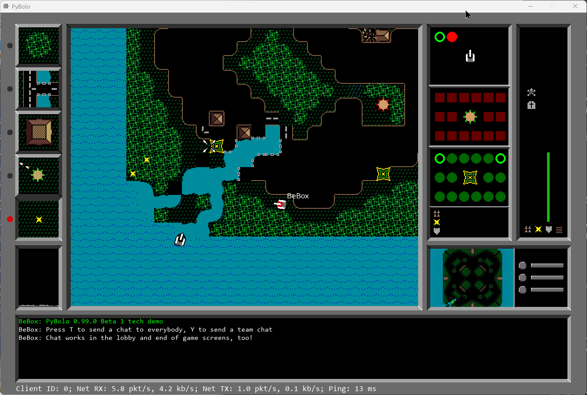

# bring-back-BOLO

<div align="center">

[](LICENSE)
[](https://www.python.org/downloads/)
[](https://www.pygame.org/)
[](#project-status)

**A faithful, modern reproduction of the classic top-down tank combat game BOLO**



*Capturing the nostalgic gameplay of the original 1980s BOLO for modern platforms*

</div>

## 📋 Table of Contents

- [Project Overview](#-project-overview)
- [Why This Project](#-why-this-project)
- [Project Status](#-project-status)
- [Repository Structure](#-repository-structure)
- [Getting Started](#-getting-started)
- [Development Guidelines](#-development-guidelines)
- [Contributing](#-contributing)
- [Features](#-features)
- [Technical Specifications](#-technical-specifications)
- [Acknowledgments](#-acknowledgments)
- [License](#-license)
- [Contact](#-contact)

## 🎮 Project Overview

### Goal

Recreate the original BOLO gameplay while providing a clean, extensible codebase for modern platforms (desktop and web).

### Scope

Movement, combat, map/objective systems, simple AI, and low-latency multiplayer networking.

## 🎯 Project Status

<div align="center">

| Phase | Status | Description |
|-------|--------|-------------|
| Research & Design | ✅ **Complete** | Game mechanics analysis and technical planning |
| Core Gameplay | 🚧 **In Progress** | Tank movement, combat, and basic game loop |
| Multiplayer | 📋 **Planned** | Network architecture and real-time synchronization |
| Advanced Features | 📋 **Future** | AI opponents, multiple game modes, mod support |

**Current Version:** 0.1.0-alpha  
**Last Updated:** November 26, 2025

</div>

## 💡 Why This Project

BOLO was memorable for its simple, tactical top-down tank combat on LAN. This project aims to capture that satisfying gameplay loop (movement, fire control, map control, and team coordination) and make it available to modern audiences and contributors.

## 📁 Repository Structure

```
bring-back-BOLO/
├── 📄 README.md              # Project overview and guide
├── 📄 LICENSE                # MIT License terms
├── 📄 requirements.txt       # Python dependencies
├── 📄 .gitignore            # Git ignore patterns
├── 📁 assets/               # Game assets and media
│   └── 📄 screenshot.png    # Game preview image
├── 📁 docs/                 # Documentation and references
│   └── 📄 winBOLO_reference.md  # Original BOLO research
├── 📁 lesson/               # Educational content
│   ├── 📄 LESSON_PLAN.md    # Teaching materials
│   └── 📄 tank_game.py      # Demo implementation
└── 📁 src/                  # Source code (future)
    └── 📄 main.py           # Entry point (planned)
```

### Key Files

| File | Purpose |
|------|---------|
| `README.md` | Project summary and contributor guide |
| `LICENSE` | MIT License terms |
| `requirements.txt` | Python dependencies |
| `docs/winBOLO_reference.md` | Original game research and analysis |
| `lesson/tank_game.py` | Working prototype for educational use |

## ✨ Features

- Tank movement and responsive input.
- Projectile, damage, and health systems tuned to match the original behavior.
- Map/objective support (capture, escort, domination-style modes).
- Local and networked multiplayer with a low-latency focus.
- Mod-friendly data/layout for easy community expansions.

## 🚀 Getting Started

### Quick Start (Running the Demo)

```bash
# Clone the repository
git clone https://github.com/yourusername/bring-back-BOLO.git
cd bring-back-BOLO

# Install dependencies
pip install -r requirements.txt

# Run the educational prototype
python lesson/tank_game.py
```

### For Contributors

1. **Fork** this repository and create a short issue describing your planned change
2. **Create** a branch with a descriptive name, e.g., `feat/ai-pathfinding` or `fix/controls`
3. **Implement** your change, keep commits focused, and include a short demo when applicable
4. **Open** a pull request targeting `main` with a clear description of what changed and why

### 🛠️ Development Setup

#### Prerequisites
- Python 3.10 or higher
- Git
- Virtual environment support

#### Windows Setup
```powershell
# Create virtual environment
python -m venv .venv

# Activate virtual environment
.venv\Scripts\Activate.ps1
# If blocked by execution policy:
Set-ExecutionPolicy -Scope Process -ExecutionPolicy Bypass
.venv\Scripts\Activate.ps1

# Install dependencies
python -m pip install --upgrade pip
pip install -r requirements.txt

# Run the educational prototype
python lesson/tank_game.py
```

#### Cross-Platform Setup
```bash
# Create virtual environment
python -m venv .venv

# Activate (Linux/macOS)
source .venv/bin/activate
# Windows
.venv\Scripts\activate

# Install dependencies and run
pip install -r requirements.txt
python lesson/tank_game.py
```

## 👨‍💻 Development Guidelines

### Code Quality
- **Open an issue** before starting large work to discuss scope
- **Keep PRs small** and focused; include tests or demos when reasonable
- **Follow formatting** and code conventions used by the codebase
- **Add documentation** for new features and changes

### Commit Guidelines
```
feat: add enemy AI behavior
fix: resolve bullet collision detection
docs: update installation instructions
style: format code with black
refactor: optimize tank movement logic
```

## 🤝 Contributing

We welcome contributions from the community! Here's how you can help:

### Ways to Contribute
- 🎮 **Playtest** prototypes and report gameplay differences
- 💻 **Contribute code**, maps, assets, or documentation
- 🏗️ **Help improve** CI, packaging, and cross-platform support
- 🐛 **Report bugs** and suggest features through issues
- 📚 **Improve documentation** and examples

### Pull Request Process
1. Fork the repository
2. Create a feature branch (`git checkout -b feature/amazing-feature`)
3. Make your changes with proper commits
4. Push to the branch (`git push origin feature/amazing-feature`)
5. Open a Pull Request with a clear description

## 🛠️ Technical Specifications

### Current Stack
- **Language:** Python 3.10+
- **Graphics:** Pygame 2.0+
- **Architecture:** Client-side game with planned multiplayer support

### Planned Enhancements
- Network multiplayer with authoritative server
- Multiple game modes (CTF, Deathmatch, King of the Hill)
- Map editor and custom map support
- AI opponents with difficulty levels

## 🙏 Acknowledgments

### Historical References
- **Original BOLO** by Stuart Cheshire (1980s)
- **WinBolo/Orona** open-source implementations
- Community maps and mods from the original era

### Educational Resources
- Pygame documentation and community
- Python game development tutorials
- Retro gaming design principles

### Research Materials
See [`docs/winBOLO_reference.md`](docs/winBOLO_reference.md) for detailed analysis of original game mechanics and design patterns.

## 📄 License

This project is licensed under the **MIT License** - see the [`LICENSE`](LICENSE) file for details.

**Key points:**
- ✅ Free to use, modify, and distribute
- ✅ Commercial use allowed
- ✅ Include original copyright and license
- ❌ No warranty provided

## 📞 Contact

<div align="center">

### Get in Touch

**Questions?** Open an [issue](https://github.com/yourusername/bring-back-BOLO/issues)  
**Discussions?** Start a [discussion](https://github.com/yourusername/bring-back-BOLO/discussions)  
**Contributions?** Submit a [pull request](https://github.com/yourusername/bring-back-BOLO/pulls)

---

**Happy coding! 🎮✨**

*Built with ❤️ for the gaming and Python communities*
</div>
